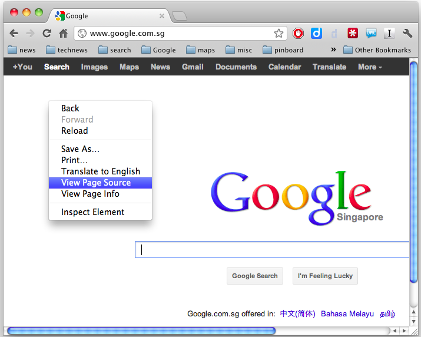

.. highlight:: html

==========================
Hyper Text Markup Language
==========================

HyperText Markup Language (HTML) is the lingua franca of the web. Creating a web
page always involves writing an html document. Three observations from the name: 

1. html files are text files 
#. html is a markup language; it uses annotations (tags) to describe
   the content
#. hyper means that html is more than simple text; it allows links. 


Elements, tags, attributes
--------------------------

An HTML document is written using html *elements*. An element has the following
form: ``<tag>content</tag>`` -- opening tag, content, closing tag. For example
to emphasize a part of a phrase, one can write in the text editor::

    some regular text followed by <b>bold text</b>

``<b>`` and ``</b>`` is the markup that the browser will use to render the
text as:

.. container:: box-serif

   |    some regular text followed by **bold text**

The browser interprets html elements and translates them into visual results.
Most html elements have an opening and a closing tags enclosed in angle
brackets. There are also empty elements that don't have content and a closing
tag: ``<tag />``. The simplest example is ``<br />`` which is used to force a
text-line break [*]_::

    <p>I have nothing to say.<br />And I'm saying it.</p>

which renders as:

.. container:: box-serif

     |   I have nothing to say.
     |   And I'm saying it.


.. [*] html transforms all whitespace characters 
       (space, tab, newline) into a single space character.

Another example of an "empty" element is ```` which is used to insert
an image into a document. However, ```` requires a path specification to
the actual image file::

     
    
``src`` is an example of an attribute of an html element. Attributes are
name-value pairs separated by equal sign (``attr_name=value``). The names of the
attributes are predefined.  While the values are set by the programmer according
to the needs. Values need to be put inside single (``'``) or double (``"``)
quote marks. Attributes are always placed inside the opening tag. An element can
contain more than one attribute::

     

Some attributes are generic and can be applied to any html elements (ex. 
``class``, ``id``, ``name``), while others are specific to particular elements.

Hyperlinks are created using an anchor element ``<a>``. Anchor refers to the
content of the ``<a>`` element, the part of the document that will appear as a
linked text. The destination of the link is specified in the *href* attribute.
Links can point to:

a) locations on the web::

    John von Neumann's wife was a 
    <a href='http://en.wikipedia.org/wiki/Human_computer'>Computer</a> 

b) local files on the same computer/server::

    This is the end of the introduction to HTML. 
    Click <a href='intro_css.html'>here</a> for the introduction to CSS. 

c) even inside the same file::

    <p id='first_paragraph'>In the beginning was the command line.</p> ... 
    <a href='#first_paragraph'>Back to the beginning</a>


HTML elements can be embedded inside each other:: 

    <p><em>Lorem ipsum dolor sit amet...</em></p> 
    <a href='/app/logout'></a> 

The last example shows that links are not limited to text.

In fact the whole html document can be considered as an html element with
content embedded inside ``<html>`` and ``</html>`` tags. The content is further
divided into head and body elements. All html documents have the following basic
structure::

    <html lang='en'> 
        <head> 
            <title>Page title</title> 
            <meta charset='utf-8' /> 
        </head> 
        <body> 
            <!-- this is a comment (ignored by browser) --> 
            Actual text that will appear on the screen... 
        </body> 
    </html>

The head tag is used to provide meta information about the page, such as
document's title, author, character encoding, keywords (for search engines) etc.
Actual content that will appear in the browser is the content of the body
element.

In the example above, the text is *indented* in a way that makes it easier to
understand the embedded structure of elements. Multiple whitespace characters
are ignored by the browser, but such formatting greatly improves code
readability for fellow human developers.


Debugging 
---------

Programming is an activity filled with "huh?" and other surprise
moments when things don't work as expected. Looking for what causes unexpected
results and fixing problems is called debugging. With html for example, it
may happen that changes in the text editor are not reflected when the file is
opened (reloaded) in the browser. The fist thing to check is whether the text
editor and the browser are displaying the same file. When in doubt, html source
can be viewed in the browser via "View page source" (right click or View ->
Developer -> View source).


   
   View Source in Chrome


Further reading
---------------

1. http://en.wikipedia.org/wiki/HyperText_Markup_Language 
#. http://en.wikipedia.org/wiki/HTML_element 
#. http://en.wikipedia.org/wiki/Debugging
