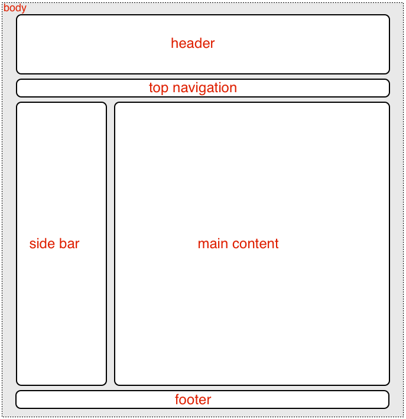
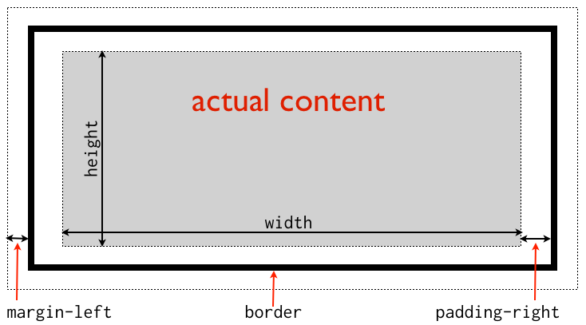
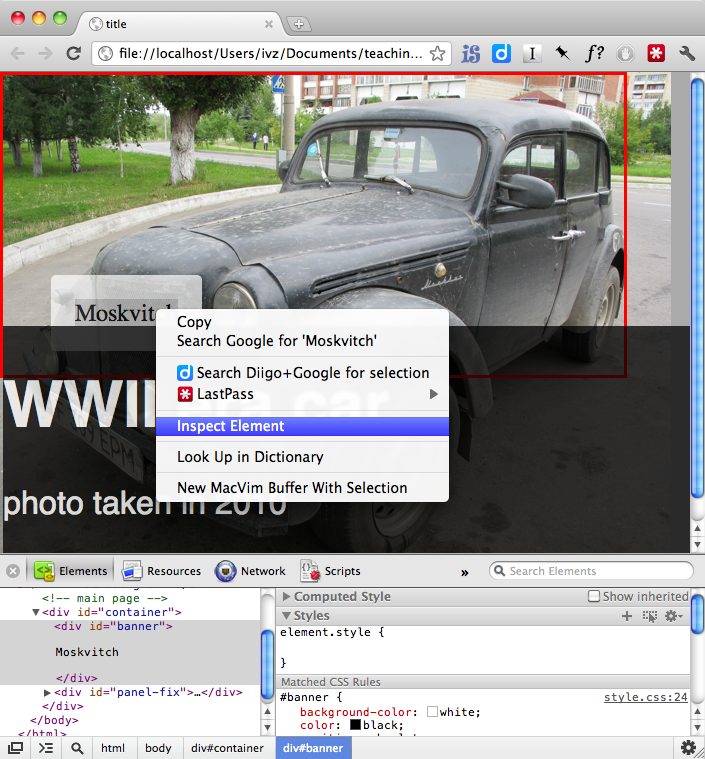

.. highlight:: css

======================
Cascading Style Sheets 
======================

Programming language syntax 
----------------------------

Every programming language has a set of rules that need to be followed to write
correct statements. Most programming languages have rather limited capacity at
interpreting badly formed statements which result in either syntax error
messages or undesirable and sometimes unpredictable outcomes. With HTML for
instance, forgetting to close the ``<b>`` tag will result in the rest of the
document (until closing tag of the parent element [*]_) in bold font. There are
common syntax features among many languages such as *reserved words*, *code
blocks begin* and *end* statements and characters used as special *delimiters*.
With HTML, reserved words are the names of the elements (``body``, ``p``, ``a``,
``img``,...) and attributes (``src``, ``width``, ``href``, ``title``, ...);
begin and end correspond to ``<tag>`` and ``</tag>``.  Angular brackets are part
of the syntax and can not be replaced with something else. 

In many languages, ``=`` is used to assign a value to a label (attribute,
property, variable) as in ````.  Assignment [#]_ is not
exactly the same as "equal" in the mathematical sense.  Quote marks (single or
double) around a value usually mean that the value is represented as text
characters rather than some other data type [#]_.

.. [*] Embedded HTML elements are called "child" elements, and the enclosing
       elements are called "parent" elements.


CSS basics
----------

In the beginning, HTML documents contained both text and style instructions for
fonts and colors (via ``<font>`` element and other stylistic attributes). But
building large websites with many pages while keeping consistent style is very
difficult without separating content from presentation.  Hence HTML and CSS.
CSS is used both for setting the style (colors, fonts,...) and for the
page layout (navigation and content areas) specification. There are 3 important
things to understand about CSS syntax: 

* selection rules
* properties
* values

The general syntax is the following::

    selector { 
        property: value; /* this is a comment */ 
        another_property: another_value; 
    } 

Here's an example of settings that will affect the ``<body>`` of the document::

    body { 
        background-color: black; 
        color: white; /* text color */ 
        font-size: 14pt; 
    }

If no other rules are defined, this style will be *inherited* by all other
elements inside the ``<body>``. CSS uses a priority scheme based on the order of
style specification and parent-child relationship between html elements to
determine the actual style to apply to a particular element. There is what
cascade refers to. 


Selection rules 
~~~~~~~~~~~~~~~

Selection rules allow to target specific html elements or a group of elements on
a page. Here's an example of simple grouping::

    h1, h2, h3 { color: navy; } /* top 3 headers are dark blue */

More specific targeting of elements is achieved using ``class`` and ``id``
attributes of html elements. Consider the following:: 

    p {...}       /* all paragraphs */ 
    p.quote {...} /* <p class='quote'> */ 
    p#first {...} /* <p id='first'> */ 
    
Normally ``id`` is used to identify a single element, while a ``class`` is used
to identify two or more elements (usually semantically related). Selection by
``class`` or ``id`` can be done without specifying an element:: 

    .quote {...} /* <p class='quote'> or <div class='quote'> */ 
    #first {...} /* <p id='first'> or <div class='first'> */

Finally, there's a descendant selection rule which allows targeting of elements
embedded into other elements::

    /* remove underline from links inside quotation paragraph */ 
    p.quote a { 
        text-decoration: none; 
    }


CSS Properties 
~~~~~~~~~~~~~~

CSS properties are similar to attributes of HTML elements except that they are
separated from values by a colon ``:``. Also like attributes, properties names
are predefined. Unlike attributes, CSS allows multiple ways to specify
properties. So called long and short versions. Here's an example with fonts:: 

    /* long form */ 
    p.quote { 
        font-family: Verdana, sans-serif; 
        font-style: italic;
        font-size: 1.2em; 
    } 

    /* short form */ 
    p.quote { font: italic 1.2em Verdana,sans-serif; } 
    
Full font specification is quite elaborate [#]_.


CSS Values
~~~~~~~~~~

Values correspond to actual desired settings. Unlike values of html attributes,
css values usually don't require quotes (except for ``font-family`` names
containing spaces ex. "Helvetica Neue"). Because of long and short forms of
properties specifications, values are either a particular value or a list of
values separated by whitespace. The order of values in the list is important.
Many CSS values can be specified in alternative forms: by predefined keyword, as
an absolute or a relative value. Many values have units associated to them.
Again an example with font::

    body { font-size: 12pt; }   /* absolute value */ 
    em   { font-size: larger; } /* keyword */ 
    em   { font-size: 150%; }   /* relative to parent */ 
    em   { font-size: 1.5em; }  /* relative to parent */ 

Colors [#]_ can also be specified in multiple ways:: 

    a { color: green; }          /* keyword */
    a { color: rgb(0, 128, 0); } /* RGB triplet (0..255) */ 
    a { color: rgb(0, 50%, 0); } /* RGB triplet (0..100%) */ 
    a { color: #008000; }        /* hex triplet #rrggbb (0..F) */


Linking CSS and HTML 
--------------------

There are 3 ways to add style to an HTML document. The first one is called
inline::

    <p style='color: blue;'>morning blues</p> 
    
While inline CSS is possible, it goes against the idea of separation of content
and presentation. CSS can be specified inside the head element of the page. This
is called internal CSS::

    <head>
        <style type='text/css'> 
        body { background-color: black; color: white; }
        </style> 
    </head> 

Finally, CSS code can be put in a separate file on the same computer or even on
a remote server and linked to the html page also from within the head element.
This is called external CSS::

    <head>
        <link rel='stylesheet' type='text/css' href='style.css'>
    </head>


Page layout 
-----------

Websites must provide content as well as means to navigate through the site. The
pages are often divided into areas for this purpose. A typical page layout for a
blog might look like:



   Classical two-columns page layout 

Such divisions are made using the ``<div id='...'>`` element [*]_ with ``id``
names defined by the programmer or web designer to suit the context of the
site. Divs are invisible by default. In order to "see" them, one must specify
CSS properties like ``background-color`` and ``border``. From a browser's
perspective, an html page is a collection of "boxes" that need to positioned
inside browser's window [#]_. Even text characters and words are "inside" their
own little "boxes". Boxes can be either *block* level or *inline* (values for
``display`` property). Their position is calculated automatically following the
so called normal "flow", unless specified otherwise.

.. [*] HTML5 introduced new elements for page layout: `header``, ``footer``, 
    ``nav``, ``aside``. (``<header>`` replaces ``<div id='header'>``)


Box properties 
~~~~~~~~~~~~~~

Boxes have a ``width`` and a ``height``. Boxes also have ``margins`` (outer space), 
``border`` and ``padding`` (inner space)


    
   Box properties 


The values are specified either in pixels or as a percentage of the width/height
of parent boxes::

    body { 
        width: 960px;
    } 
    div#page { 
        border: 1px dotted; 
        width: 80%;           /* relative to body */ 
        height: 400px; 
        margin: auto;         /* automatic horizontal centering */ 
    } 
    
The values for ``margin`` and ``padding`` also often use "font" units like
``em``. The short form for setting ``maring`` and ``padding`` has 4 possible
forms::

    margin: a b c d; /* a = top, b = right, c = bottom, d = left */
    maring: a b c;   /* a = top, b = right&left, c = bottom */
    margin: a b;     /* a = top&bottom, b = right&left */
    margin: a;       /* a = top&bottom&right&left */


Positioning
~~~~~~~~~~~

Changing the positioning of html elements to something other than the default
"normal flow" involves changing the ``position`` property as well as offset
properties (``left``, ``top``, ``right``, ``bottom``). Most of the time, the
elements are positioned with respect to the html document and elements inside
the documents.  But sometimes it is desirable to "detach" the elements from the
document and positions them relative to the browser window (relative to
viewport). Position can have four values: ``static``, ``relative``,
``absolute``, ``fixed``. This naming is unfortunately confusing because
"absolute" is still a "relative" term...     

* ``static`` - default (normal flow, specified offsets are ignored) 
* ``relative`` - like static, the element is part of the flow, but offsets 
  change current position.
* ``absolute`` - takes the element out of the normal rendering flow, offsets 
  are relative to the parent element 
* ``fixed`` - takes the element out of the normal rendering flow, offsets are 
  relative to viewport (browser window)

For non-static elements, actual placement is determined by the values of
horizontal (``left`` or ``right``) and vertical (``top`` or ``bottom``) offsets
properties. These properties work relative to the parent box (div or other
container). It is enough to choose two out of four possible combinations
(top-left, top-righ, bottom-left, bottom-right):: 

    .container { 
        width: 90%; 
        position: relative; 
    } 
    .container #banner{ /*attach to lower left corner */
        position: absolute; 
        left: 2em; 
        bottom: 1em; 
    } 

Positioning can be tricky, but there are good online tutorials [#]_ [#]_.  In
addition to position and offsets, elements can "float" and be "clear"ed.
Appearance on the screen can be affected via the ``display``, ``visibility``
and ``overflow`` properties.

Lists and menus 
---------------

HTML provides two elements for creating lists, ``ol`` for ordered (numbered)
and ``ul`` for unordered lists. Each list item is specified as a ``li``
element:

.. code-block:: html

    <ul>
        <li>item 1</li> 
        <li>item 2</li>
        <li>item 3</li>
    </ul> 

Web sites often provide menus to help navigate through the site. However, there
are no special html elements for this. Instead, unordered lists with a
particular style are used. A horizontal menu can be obtained with the following
style::

    .top-menu ul { 
        list-style: none; /* remove bullets */ 
    } 
    .top-menu ul li {
        display: inline-block; 
    } 


More Debugging and other tips 
-----------------------------

Positioning and page layout in general is guaranteed to generate "huh/wtf" [*]_
 moments on a regular basis. It is useful to know the tools that help solving those and
other non-obvious problems. All modern browsers provide developer tools. 

|   View -> Developer -> Developer Tool in Chrome
|   Develop -> Show Web Inspector in Safari.

.. [*] what-the-flow 

Firefox has an excellent firebug extension [#]_. Actually the dev tools in all
webkit based browsers are based on firebug. Another way of getting into the dev
tools is to "Inspect element" (via right click on that element, see Fig. 5). Dev
tools are also a great way to learn how other sites are built. Moving the mouse
pointer over html elements in the dev tools window will highlight the bounding
box of that element on the actual page.



   Developer Tools 

While creating a web page (or developing an application), and especially during
debugging, it is important to reduce the time it takes to see the result of code
modification. Saving modifications in the text editor and refreshing the page is
always faster via keyboard shortcuts compared to mouse clicks.


Libraries and Frameworks 
------------------------

Programming in general means solving a particular problem. The problems are
often big and need to be broken into smaller pieces to be solved separately.
Very often big problems have common subproblems. Common solutions to such
subproblems can be put together for reuse. This is called DRY principle of
software development [#]_. Collections of solutions themselves are called
libraries, and a collection of libraries (related in a bigger context) is called
a framework. Until recently, there have been few established libraries for
html/css because of cross-browser incompatibilities in terms of page rendering.
These differences are getting smaller and the principles of good page layout are
also better understood. This is why in the last few years, there was an
emergence of CSS libraries. One of such libraries is twitter's bootstrap [#]_,
and there are many others.


Further reading
---------------

.. [#] http://en.wikipedia.org/wiki/Assignment_(computer_programming) 
.. [#] http://en.wikipedia.org/wiki/Data_type 
.. [#] http://www.w3.org/TR/css3-fonts/ 
.. [#] http://www.w3.org/TR/css3-color/ 
.. [#] http://www.w3.org/TR/css3-box/
.. [#] http://www.alistapart.com/articles/css-positioning-101/ 
.. [#] https://developer.mozilla.org/en/CSS/position 
.. [#] http://getfirebug.com/ 
.. [#] http://en.wikipedia.org/wiki/DRY 
.. [#] http://twitter.github.com/bootstrap/

